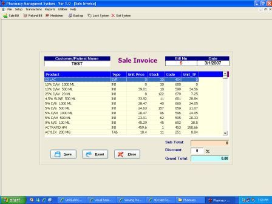

<div align="center">

## Retail Pharmacy


</div>

### Description

A complete Medical Store Retail Management System. Sales &amp; Inventory Control. Stock Monitoring with expiry dates etc...
 
### More Info
 
This is my first sumbission on PSCODE, as i'm getting help from PSCODE a lot from last couple of years. So its time to give back something. Plz dont forget to vote me......

a lot.

none....


<span>             |<span>
---                |---
**Submitted On**   |2007-03-01 04:58:36
**By**             |[Sajjad Ahmad](https://github.com/Planet-Source-Code/PSCIndex/blob/master/ByAuthor/sajjad-ahmad.md)
**Level**          |Advanced
**User Rating**    |4.7 (70 globes from 15 users)
**Compatibility**  |VB 6\.0
**Category**       |[Databases/ Data Access/ DAO/ ADO](https://github.com/Planet-Source-Code/PSCIndex/blob/master/ByCategory/databases-data-access-dao-ado__1-6.md)
**World**          |[Visual Basic](https://github.com/Planet-Source-Code/PSCIndex/blob/master/ByWorld/visual-basic.md)
**Archive File**   |[Retail\_Pha205093312007\.zip](https://github.com/Planet-Source-Code/sajjad-ahmad-retail-pharmacy__1-68020/archive/master.zip)

### API Declarations

```
Here are the links to download to two ocx's used in project.
http://rapidshare.com/files/19139938/iGrid250_75B4A91C.ocx.html
http://rapidshare.com/files/19140026/PRJCHAMELEON.OCX.html
```


